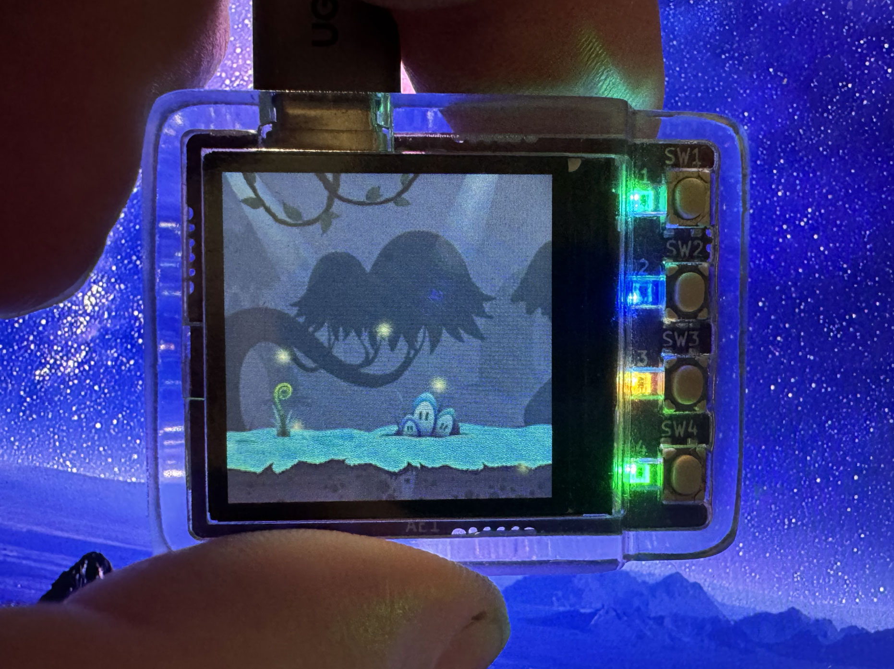
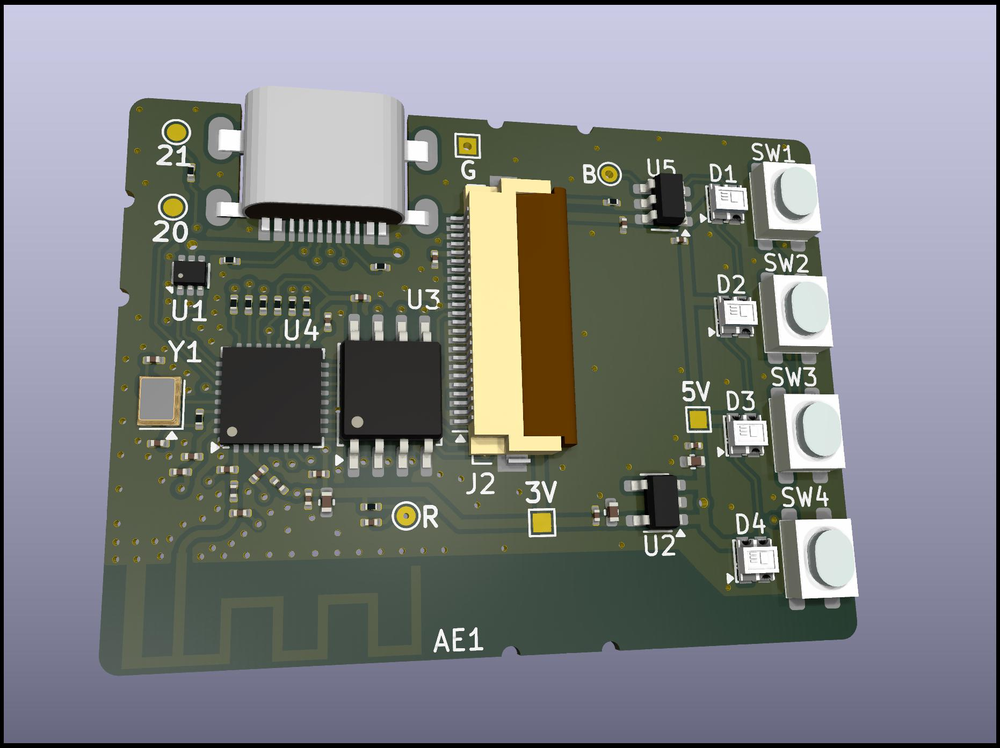

Welcome to **Firefly**, the open-source, open-hardware Firefly
Hardware Wallet.

The device we are currently working on is the *Firefly Pixie*,
based on the ESP32-C3 (32-bit, RISC-V; 400kb RAM), 16MB flash,
240x240 16-bit color IPS display and 4 buttons.

  
  

**Links:**

- [Hardware](https://github.com/firefly/pixie-device) schematics and PCB design
- [Firmware](https://github.com/firefly/pixie-firmware)
- [Case](https://github.com/firefly/pixie-case)

Reaching Out
------------

- [Discussions Forum](https://forum.firefly.app)
- E-mail: 
  - Development: [RicMoo](mailto:ricmoo@firefly.app), [Yuet Loo](mailto:yuetloo@firefly.app)
  - Community and Operations: [Alisha](mailto:alisha@firefly.app)
- Social Media:
  - [X / Twitter](https://x.com/fireflypocket)
  - [Instagram](https://www.instagram.com/fireflypocket/)
  - [Warpcast](https://warpcast.com/firefly)
